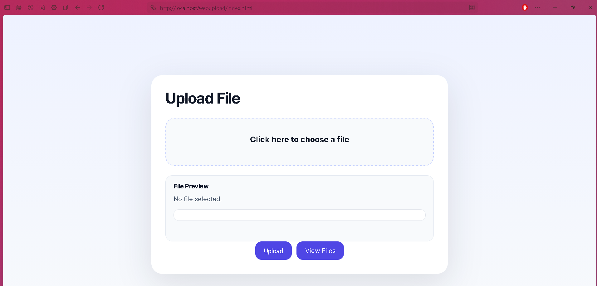
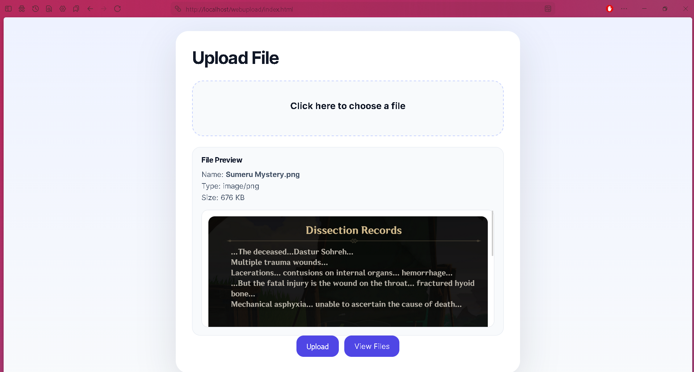
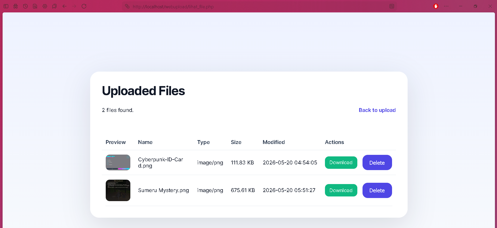
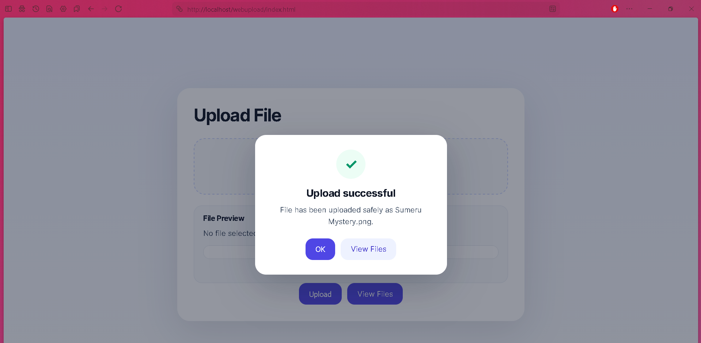
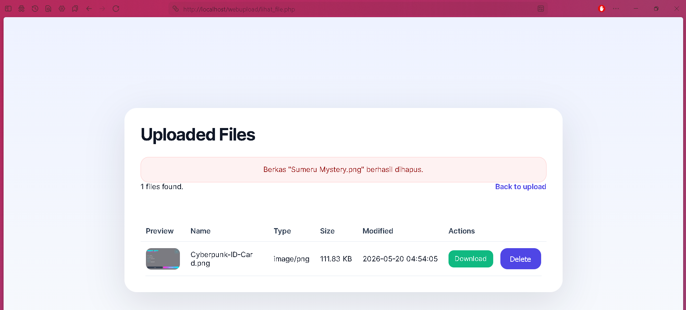
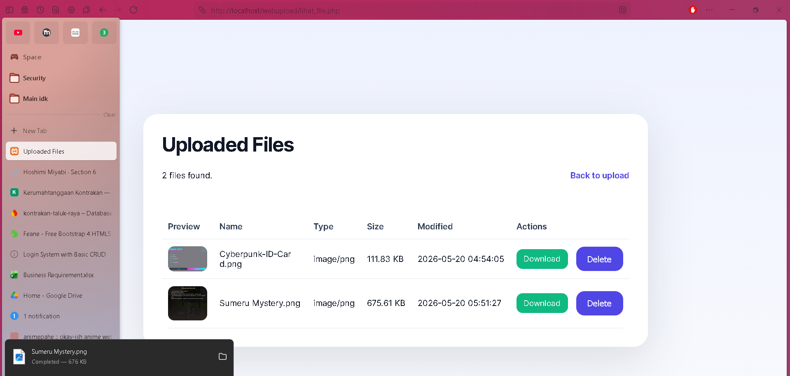

Nama : Farhan Rasyid Mustaqim
NIM : 20240140102
Kelas : B
Mata Kuliah : Keamanaan Siber

---

## Fitur

- Unggah berkas dengan **pratinjau (preview)** sebelum dikirim.
- Validasi sisi server: hanya `JPG`, `JPEG`, `PNG`, `GIF`.
- Pemeriksaan **MIME / isi berkas asli** (anti `shell.php.jpg`).
- Pop-up notifikasi keberhasilan unggah (tanpa pindah halaman).
- Halaman **View Files** untuk melihat, **mengunduh**, dan **menghapus** berkas.
- Folder `uploads/` dilindungi `.htaccess` agar skrip tidak dapat dijalankan.

---

## Teknologi

| Bagian | Teknologi |
|--------|-----------|
| Frontend | HTML, CSS, JavaScript (Fetch API) |
| Backend | PHP |
| Server | Apache (XAMPP) |

---

## Struktur Berkas

```
webupload/
├── index.html        # Halaman utama (form unggah + pratinjau + pop-up)
├── upload.php         # Proses & validasi unggahan (backend)
├── lihat_file.php     # Halaman daftar berkas (lihat / unduh / hapus)
├── styles.css         # Gaya tampilan
├── script.js          # (opsional) skrip tambahan
├── uploads/           # Lokasi berkas terunggah
│   └── .htaccess      # Mencegah eksekusi skrip di folder unggahan
└── assets/            # Tangkapan layar untuk dokumentasi
```

---

## Cara Menjalankan

1. Salin folder `webupload` ke dalam `htdocs` XAMPP (mis. `C:\xampp\htdocs\webupload`).
2. Jalankan **Apache** dari XAMPP Control Panel.
3. Buka di peramban: `http://localhost/webupload/`.

---

## Tangkapan Layar (Hasil Project)

### 1. Sebelum Unggah
Tampilan awal halaman unggah sebelum berkas dipilih.



### 2. Pratinjau (Preview)
Pratinjau berkas muncul setelah pengguna memilih sebuah gambar.



### 3. Hasil Upload
Pop-up notifikasi muncul ketika unggahan berhasil.



### 4. Daftar Berkas Setelah Upload
Berkas yang berhasil diunggah tampil pada halaman **View Files**.



### 5. Hasil Delete
Notifikasi setelah berkas berhasil dihapus.



### 6. Hasil Unduh
Berkas berhasil diunduh melalui tombol **Download**.



---

## Catatan Keamanan

- Validasi dilakukan di **sisi server** (`upload.php`), bukan hanya di sisi klien.
- `uploads/.htaccess` mematikan mesin PHP (`php_flag engine off`) sehingga berkas yang terunggah tidak dapat dieksekusi.
- Nama berkas diproses dengan `basename()` untuk mencegah *path traversal*.
